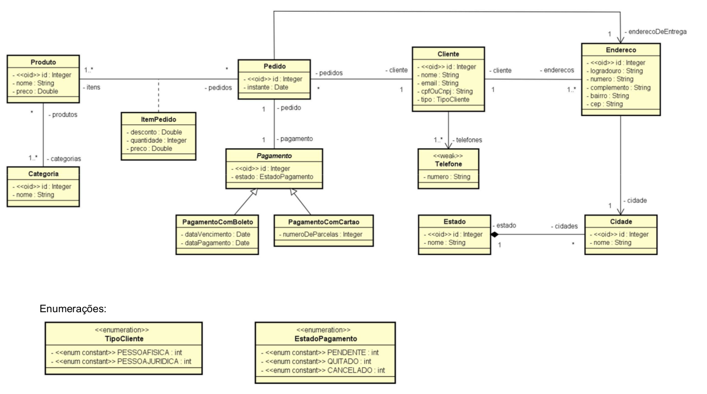

# Shopy-API

Este projeto é uma API [Spring Boot](http://projects.spring.io/spring-boot/) desenvolvida para servir como e-commerce.

## Diagrama de Classes




## Requisitos da Máquina

Para rodar a aplicação você irá precisar de:

*   [JDK 1.8](http://www.oracle.com/technetwork/java/javase/downloads/jdk8-downloads-2133151.html) - Java™ Platform, Standard Edition Development Kit 
*   [Maven 3](https://maven.apache.org) - Gerenciador de Dependências
*   [Spring Boot](https://spring.io/projects/spring-boot) - Framework para facilitar o bootstrapping and desenvolvimento de novas aplicações Spring 
*   [MySQL](https://www.mysql.com/) - Sistema de Gerenciamento de Banco de Dados Relacional Open-Source 
*   [Git](https://git-scm.com/) - Sistema de Controle de Versão


## Ferramentas Externas Utilizadas

* [Postman](https://www.getpostman.com/) - API Development Environment (Testing Documentation)
* [Thymeleaf](https://www.thymeleaf.org/) - Server-side Java template engine (Template dos e-mails)


## Rodando a Aplicação Localmente

Primeiro renomeie o arquivo `ApplicationExample.properties` em `shopy/src/main/resources/`  para `applicatioin.properties` e preencha-o com os dados necessários correspondentes às configurações da sua máquina. 

Há diversos caminhos para rodar uma aplicação com Spring Boot na sua máquina local. Um deles é executar o método `main` na classe `shopy/src/main/java/com/anaclara/shopy` da sua IDE. Para tal sga os passos abaixo:
1. Faça o Download do zip do projeto ou clone o repositório Git
2. Extraia o conteúdo do zip
3. Abra o Command Prompt e navegue ($cd) até a pasta contendo o pom.xml
4. Abra o eclipse
5. Vá em: File -> Import -> Existing Maven Project -> Navegue até a pasta onde você extraiu o zip
6. Selecione o projeto
7. Choose the Spring Boot Application file (search for @SpringBootApplication)
8. Clique com o direito no arquivo e faça Run as Java Application

Uma alternativa é utilizar o [Spring Boot Maven plugin](https://docs.spring.io/spring-boot/docs/current/reference/html/build-tool-plugins-maven-plugin.html) com o comando:

```shell
mvn spring-boot:run
```

### Segurança


### URLs

|  URL |  Método | Descrição |
|----------|--------------|--------------|


## Arquivos e Diretórios

O projeto tem uma estrutura de diretórios particular. Uma árvore representativa é mostrada a seguir:

```
.
├── algamoney-api
├── src
│   └── main
│       └── java
|            └── com.anaclara.shopy
│                   ├── AlgamoneyApiApplication.java
├── src
│   └── main
│       └── resources
├── src
│   └── test
│       └── java
├── JRE System Library
├── Maven Dependencies
├── src
├── target
│   └──application-0.0.1-SNAPSHOT
├── mvnw
├── mvnw.cmd
├── pom.xml
└── README.md
```

## Pacotes


## Cliente


